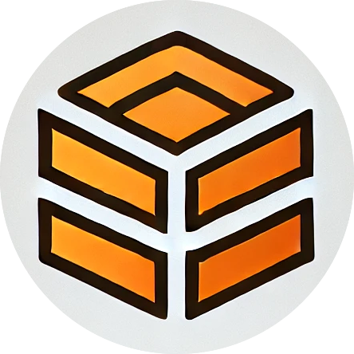

# notnion-tools

`notion-tools` is a collection of utilities designed to enhance your productivity with Notion. These tools provide additional functionalities and integrations that are not available out-of-the-box, making it easier to manage and automate your Notion workflows.

-> [Document](https://docs.rs/notion-tools/latest/notion-tools)

## Usage

To use this library, you need to set the `NOTION_API_KEY` and `NOTION_DATABASE_ID` environment
variables. The `NOTION_API_KEY` is required for authentication, while the `NOTION_DATABASE_ID`
is optional and can be set later using the `database` method.

## Implemented endpoints

| Endpoint | Implemented | Code |
|---|:---:|---|
| [Create a Token](https://developers.notion.com/reference/create-a-token) | - | |
| [Append block children](https://developers.notion.com/reference/patch-block-children) | ✅ | [`Notion::append_block_children`](Notion) |
| [Retrieve a block](https://developers.notion.com/reference/retrieve-a-block) | - | |
| [Retrieve block children](https://developers.notion.com/reference/get-block-children) | - | |
| [Update a block](https://developers.notion.com/reference/update-a-block) | - | |
| [Delete a block](https://developers.notion.com/reference/delete-a-block) | - | |
| [Create a page](https://developers.notion.com/reference/post-page) | ✅ | [`Notion::create_a_page`](Notion) |
| [Retrieve a page](https://developers.notion.com/reference/retrieve-a-page) | - | |
| [Retrieve a page property item](https://developers.notion.com/reference/retrieve-a-page-property-item) | - | |
| [Update page properties](https://developers.notion.com/reference/patch-page) | ✅ | [`Notion::update_a_page`](Notion) |
| [Archive a page](https://developers.notion.com/reference/archive-a-page) | ✅ | [`Notion::archive_a_page`](Notion) |
| [Create a database](https://developers.notion.com/reference/create-a-database) | - | |
| [Query a database](https://developers.notion.com/reference/post-database-query) | ✅ | [`Notion::query_database`](Notion) |
| [Retrieve a database](https://developers.notion.com/reference/retrieve-a-database) | ✅ | [`Notion::retrieve_a_database`](Notion) |
| [Update a database](https://developers.notion.com/reference/update-a-database) | - | |
| [List all users](https://developers.notion.com/reference/get-users) | - | |
| [Retrieve a user](https://developers.notion.com/reference/get-user) | - | |
| [Retrieve your token's bot user](https://developers.notion.com/reference/get-self) | - | |
| [Create comment](https://developers.notion.com/reference/create-a-comment) | - | |
| [Retrieve comments](https://developers.notion.com/reference/retrieve-a-comment) | - | |
| [Search by title](https://developers.notion.com/reference/post-search) | - | |
